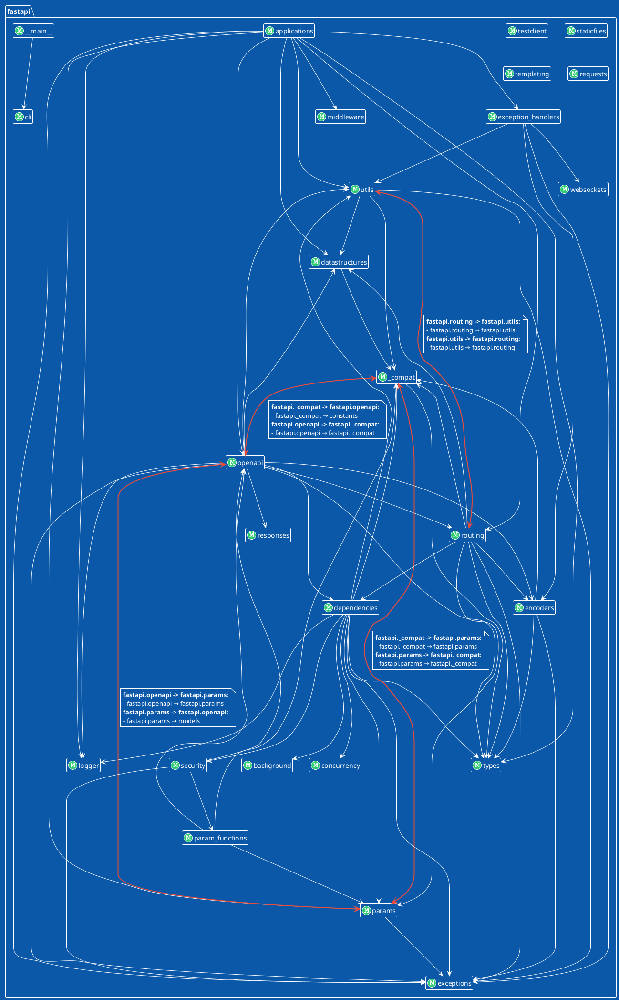
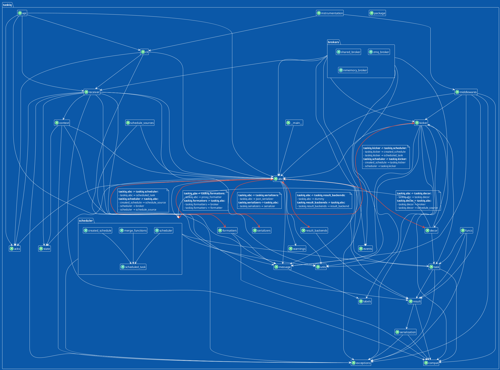

# Description

Generate modules import graph for python project. Using `plantuml` for render.

# Installation

```shell
pip install arch-blueprint
```

# Usage

Commands
```shell
arch-blueprint --help
usage: arch-blueprint [-h] --modules [MODULES ...] [--format {puml,d2}]
                      [--metric NAME] [--no-cycle-details]
                      project_dir

Generate architecture diagrams for Python applications

positional arguments:
  project_dir           Path to root directory of target project

options:
  -h, --help            show this help message and exit
  --modules, -m [MODULES ...]
                        Selected modules for rendering (examples:
                        'myapp.somemodule', 'myapp.somemodule.*',
                        'myapp.*.*.models.*', 'myapp.somemodule.**')
  --format, -f {puml,d2}
                        Output format. Possible values: ['puml', 'd2']
  --metric NAME         Show a metric block on each node (repeatable). e.g.
                        --metric fan_in
  --no-cycle-details    Hide detailed information for cyclic dependencies
```

### Metrics

- `--metric NAME` adds a per-node metric block (repeatable). Built-in metrics:
  `fan_in`, `fan_out`, `instability`. New metrics are added as self-contained
  plugins under `src/arch_blueprint/metrics/` and registered in
  `metrics/__init__.py` — no changes to the extractor or renderers are needed.

## Development

This project uses [`uv`](https://docs.astral.sh/uv/).

```shell
uv sync                       # install deps
uv run pytest                 # run the test suite
uv run pre-commit run -a      # lint, format, type-check, test (what CI runs)
```

# Examples

## FastAPI
[Commit](https://github.com/fastapi/fastapi/commit/9348a5e2cf55440ff3da3bd4b7876acd3b3f57e5)

Command:
```shell
arch-blueprint . -m 'fastapi.*'
```

### Graph



## Taskiq
[Commit](https://github.com/taskiq-python/taskiq/commit/eb29304a697f151439c12132480c4c5b8247bfa4)
Command:
```shell
arch-blueprint . -m 'taskiq.*' '*.brokers.*' '*.scheduler.*'
```

### Graph
![taskiq_graph](https://img.plantuml.biz/plantuml/png/fPXTRjGm4CVVSugWli2gMwc0X41LLLZraHCW57aJisisZbF7ATqUW0DmH4w2asms7jjZ6tZgn_moyVpdmtRkEaMawdcTlL1xocbEEDkHB5EYpPN8jq8fmVEAILeg9ffipogQKzwgOyuftrBPPLbPawxB5UaExE6gA_Uqwcigbz_ocvkNdo_pY-kFdpRlDwzkR-4JBIaFP4TdwlNzPlFksg5AmLkY8b1HSCAQeeZvgbc4qAges8hc-8fEzBAaNGJdhAfg-eF8ABcLug25lUhs6gwAwS-8Y1KjXOpuFR3IS8H0lM9rwWAV-KFQwkWZRLJCAzcMCSMfPAHcp_hTCR5fryLhYhInEYX5e-XJhEnqIljQ5LjToBIfOcjZJQTapxKYP6Yfn2gJEYQveyMtlXaxiOj8NfCjZIPILsF3cbqC6zuPPOJaHAbuQeOVYNbEqMUkHTReUIJaCQqW5rLBINMhLyNydyY3EiMn0EbJILkG8hHiIieUentfJjIgC4L4LZeLfUixisVbUhs-DNemCzeHc7Jafkrc_UNY_jtRpPlDvLRKrTU576THrWWzGNNwQjOSiZnVhKo_aFsmMcbYRGw2tpz_GNU6XsdMWKLR7YPYy35LWzzc3V1Czsu-h1fJO9fYgFMSzZILbeP9b6fv0D6hbUBfM9mnqvFHdI7T3CmldWKixuffTnh8c7agrZJXh6cRg9xr529XrND-D9tOepsadiqE3k7_l3BXaPuxFp76Cuz41-U7wMSvgta3T8Qahtq6SF5ZrGyqf7HUG9Rb690gpF848ittJZJ5WW5jZ5D7AFqcDmQvU8jrntZSn8pZYGmppZlusQwFDDX0jqtcGBTi-eICcUPT2xClHGjtQ6nPFlCqyWC07CLUmXd7Fcew4eS8Qt3v45iH7mEIEDm_43KSav4assQ_rxOxcPXFizYxFMPNHXzbYUH3G8cVTd0q4QxTYSL5nfdcsU_CiXulaH782cOw_8OrSHcueRbsSx7sXG1fn11cN2upe2YMQuyLYkC1tBWzq7Jl202MlFEbz3ysmVabqNtm10x3sTxH4EplTipfmU2c2SlTtHcXtTutF7AQXUGnWxaptuhnV9aVAP3AmH1OFXZbrX16mec0KLOrOHXin_F52mdHRpSciHU00Y38E1Y3ZAkG5xC2zp89KOEnx2L01PqkbQ6m7G3SvY5ddAlHPJkVsP2a1Jbd-p3QDwYzdpERpay0rG9V6xoBj2xwhXlxKz2_UV6lFFey-3Y3LmBEkIeFFx2yEZRu6iUSuFrKO7UwyeOltzaV)


