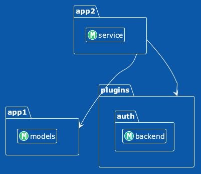
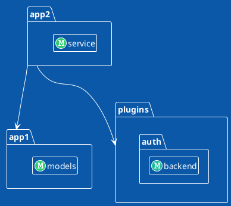
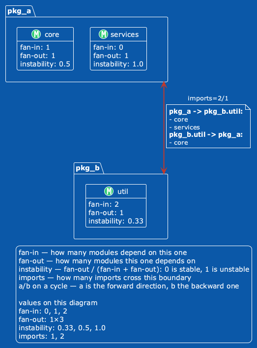
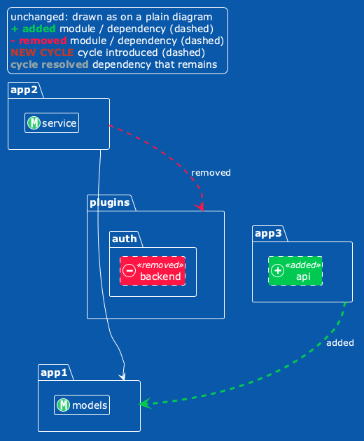
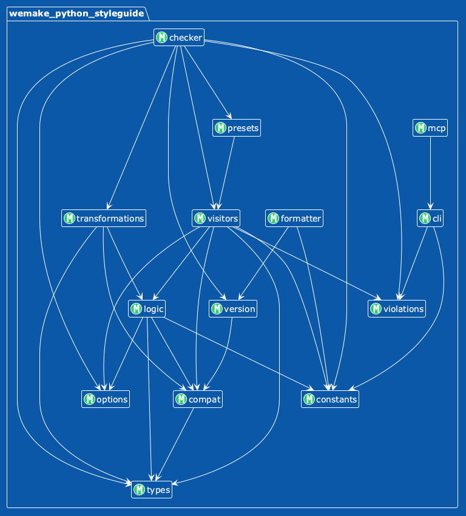
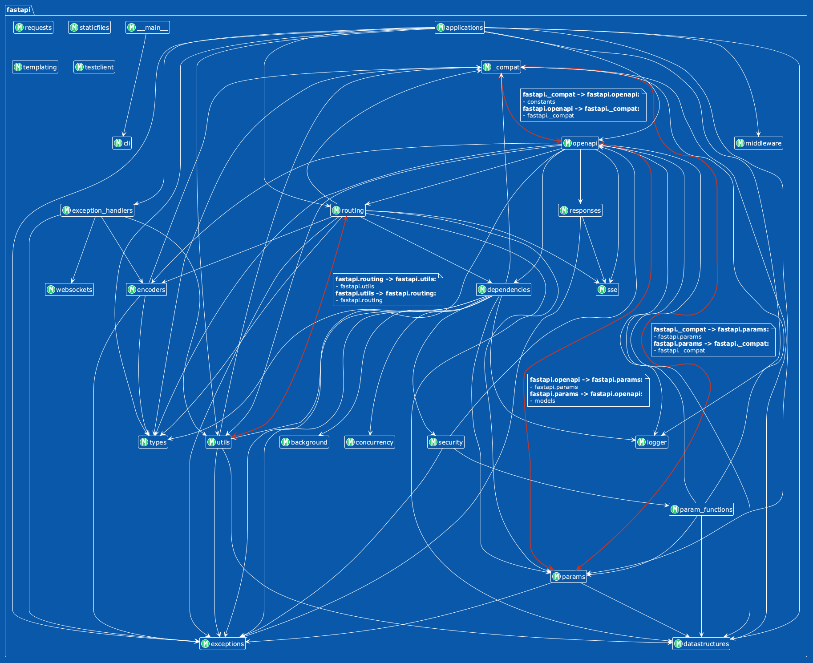
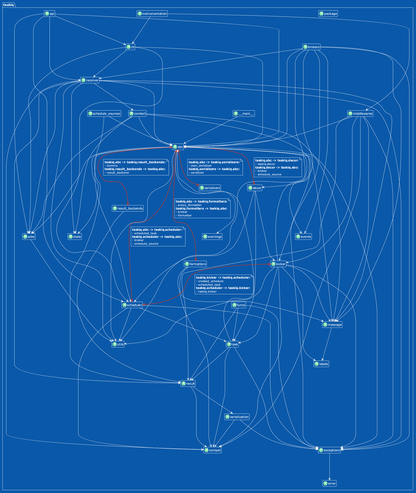
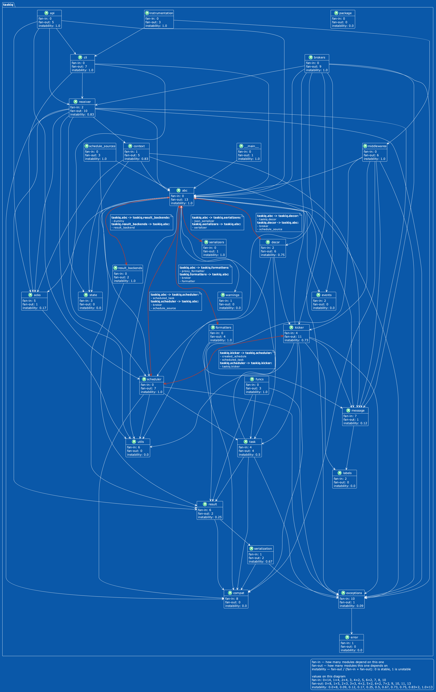

# Description

Generate modules import graph for python project. Using `plantuml` for render.

# Installation

```shell
pip install arch-blueprint
```

# Usage

```shell
arch-blueprint --help
usage: arch-blueprint [-h] --modules [MODULES ...] [--links LEVEL]
                      [--format {puml,d2,json}] [--metric NAME]
                      [--no-cycle-details]
                      project_dir

Generate architecture diagrams for Python applications. Subcommands: 'render'
draws a snapshot, 'diff' compares two, 'history' draws one diagram per commit
that changed the graph.

positional arguments:
  project_dir           Path to root directory of target project

options:
  -h, --help            show this help message and exit
  --modules, -m [MODULES ...]
                        Selected modules for rendering (examples:
                        'myapp.somemodule', 'myapp.somemodule.*',
                        'myapp.*.*.models.*', 'myapp.somemodule.**')
  --links LEVEL         What an arrow connects: 'namespace' aggregates imports
                        to the namespaces where two modules' paths diverge
                        (a.b.c -> a.d.e is drawn a.b -> a.d), 'module' draws
                        them node to node. Possible values: ['namespace',
                        'module'] (default: namespace)
  --format, -f {puml,d2,json}
                        Output format. Possible values: ['puml', 'd2', 'json']
  --metric NAME         Display a metric (repeatable). A node metric renders
                        as a block on each node (e.g. --metric fan_in); a link
                        metric renders as a label on each connection (e.g.
                        --metric edge_weight).
  --no-cycle-details    Hide detailed information for cyclic dependencies
```

A run against the bundled example project:

```shell
arch-blueprint examples/project_root -m 'app1.*' -m 'app2.*' -m 'plugins.**'
```



<details>
<summary>The PlantUML source behind it</summary>



</details>

### How the diagram is built

A **node** is a module. A **link** is aggregated to the namespace where two modules first differ, so
`app2.service` importing `app1.models` is drawn as `app2 ---> app1`. Those endpoints are declared as
`package` blocks with the modules inside, so the emitted source names everything it points at.
(PlantUML would also infer the container from the dotted class names and render the same picture —
declaring it is about the source saying what it means, not about fixing the image.) A namespace that
is itself a module (`writer` importing `storage.backend`) stays a plain class: wrapping a class in a
package of its own name is a syntax error.

`--links module` draws imports node to node instead: the same run gives
`app2.service ---> app1.models` and `app2.service ---> plugins.auth.backend`. An import that lands
inside a selected package ends on that package; an import of a package facade ends on its container.
Cycles, `edge_weight` and `diff` then work between modules. The level is part of how the graph is
built, so it is given to the command that builds it (`-f json`, `diff --base`, `history`), and a
snapshot records it — `render` and a diff of two snapshot files draw what they are given, and two
snapshots built at different levels are not diffed (exit 2).

`-m` is repeatable, which is how you graph sibling packages under a root that has no `__init__.py`
of its own. A link is drawn when both endpoints belong to the selected set — including a dependency
*on* a package whose children were selected, since `pkg.*` never selects `pkg` itself.

### Errors

Bad input is reported on stderr and exits 2; an analysis that cannot finish exits 1 (`diff` has its
own codes, below). Nothing fails
silently — a mistyped metric name is an error listing the valid ones, and a pattern matching no
modules is an error rather than an empty diagram.

```shell
$ arch-blueprint examples/project_root -m 'app1.*' --metric fanin
arch-blueprint: unknown metric 'fanin'. Available: depth, edge_weight, fan_in, fan_out, instability
```

### Metrics

`--metric NAME` is repeatable and displays a metric. Where it is drawn depends on what it measures:

| Metric | Kind | Drawn as |
| --- | --- | --- |
| `fan_in` | node | a row in the node's block |
| `fan_out` | node | a row in the node's block |
| `instability` | node | a row in the node's block — `fan_out / (fan_in + fan_out)` |
| `edge_weight` | link | a label on the connection: how many imports it stands for |

Blocks appear in the order you asked for them. A cycle is one connection standing for two links, so
a link metric shows both values there as `forward/backward`, matching the order of the cycle's own
detail block.

```shell
arch-blueprint tests/fixtures/cyclic -m 'pkg_a.*' -m 'pkg_b.*' \
  --metric fan_in --metric fan_out --metric instability --metric edge_weight
```



`pkg_b.util` is depended on twice and depends on one module, so `instability: 0.33`. The connection
is a cycle, so `edge_weight` reads `2/1`: two imports one way, one the other — the same two
directions the note spells out.

New metrics are self-contained plugins under `src/arch_blueprint/metrics/`, registered in
`metrics/__init__.py` — no changes to the extractor or renderers are needed. See `CLAUDE.md` for the
protocols.

### Snapshots, render and diff

`-f json` writes a **snapshot** of the graph instead of a diagram: modules, the imports between them
and every metric. Links, cycles and namespace containers are not stored — they are derived from the
imports again on load, so a snapshot cannot hold a stale copy of them. Every diagram can be drawn
from a snapshot, byte for byte the same as a direct run:

```shell
arch-blueprint src -m 'myapp.*' -f json > graph.json
arch-blueprint render graph.json -f puml --metric fan_in > graph.puml
```

`diff` draws what changed between two snapshots, in `puml` or `d2`:

```shell
arch-blueprint diff old.json new.json -f puml > diff.puml
```

It needs no stored files when the project is in git: `--base REV` builds the graph at that revision
(`git archive` into a temporary directory — no worktree, nothing left in `.git`) and compares it
with the working tree, or with `--head REV`. A package that exists on one side only is shown as
added or removed rather than failing the run.

```shell
arch-blueprint diff --base origin/master src -m 'myapp.*' > diff.puml
```



The change is drawn over the whole graph: everything that did not change looks as on a plain
diagram (depth colors, plain arrows, cycles as a red `<->`), and every change is dashed and in a
color of its own:

| Marker | Module | Dependency |
| --- | --- | --- |
| added | green, spot `+`, `«added»`, dashed frame | green dashed arrow, `added` |
| removed | red, spot `-`, `«removed»`, dashed frame | red dashed arrow, `removed` |
| new cycle | — | red dashed `<->`, `NEW CYCLE` (with `--cycle-details`, plus a note listing its imports) |
| cycle resolved | — | grey dashed arrow, `cycle resolved`, in the direction that remains (a bare line if neither does) |

On a large project `--changes-only` draws just the changes and the unchanged modules their imports
connect, without the unchanged dependencies.

`diff` and `history` are for a quick look at what changed, so the notes listing every import on a
cycle are off there; `--cycle-details` turns them on. Every marker carries text as well as color, so
a grey-scale image stays readable. Nothing changed still gives a valid diagram — the graph, with
"No architectural changes" in the legend — so a CI job always has a picture to post.

`diff` exits like `diff(1)`: **0** when nothing changed, **1** when something did, **2** on any
error. The diagram is written either way; to keep a drawing step green on a diff but red on an
error:

```shell
arch-blueprint diff --base origin/master src -m 'myapp.*' > diff.puml || test $? -eq 1
```

A module replaced by a package of the same name (`api.py` → `api/`) is drawn inside that package,
since no diagram can have one name be both a module and a container. A structural diff ignores metrics and depth colors (depth shifts whenever the graph does), and
treats a change to the imports inside a link present on both sides as no change. Graphing
`arch_blueprint` itself always resolves to the running copy, so `diff --base` cannot compare two
versions of this tool.

### History album

`history` walks the branch's first-parent history (one commit per merged merge request) and, for
every commit that changed the graph, draws one picture: the first frame is the plain diagram, every
later one the same diagram with what changed since the frame before marked on it (like `diff`;
`--changes-only` for just the changes). A diff declares everything in the plain diagram's order, so
consecutive frames lay out alike. Commits that leave the graph alone are skipped, so the album is
the architecture's changes and nothing else:

```shell
arch-blueprint history src myapp                                   # everything: myapp.**
arch-blueprint history src app1 app2 -m 'app1.*' -m 'app2.core.*'  # roots, narrowed by -m
arch-blueprint history src myapp --base v1.0 --head master -f d2-png -o album
```

The roots are required, one or more top-level packages. Without `-m` each is graphed with everything
under it (`ROOT.**`); with `-m` only those patterns are, and each must lie under one of the roots. A
root that a commit does not have yet — or has only as a directory with no Python in it — is no
error: the commit is reported as `no source yet`, and the root shows up in the frame where its code
appears.

An album holds one kind of file, so it is easy to leaf through. `-f` picks it:

| `-f` | Files |
| --- | --- |
| `puml` (default), `d2` | diagram sources |
| `puml-png`, `d2-png` | PNG images only, drawn with `plantuml` / `d2` from `PATH` (checked before any work starts) |

```
album/
  0001_2026-05-02_ab12cd3.png    the first frame: the plain diagram
  0002_2026-05-12_ef45ab6.png    the diagram at that commit, its changes marked
  index.md                       the frames in order, with dates and commit subjects
```

Everything is cached in `./.arch-blueprint` (or `--cache-dir`): every commit's snapshot, keyed by
the project's git tree, and every image, keyed by the diagram it shows. If drawing fails, the run
exits 1 and a rerun builds nothing and draws only the images still missing; another album of the
same history reuses them too. d2 refuses to rasterize a very large diagram; such a diagram is
redrawn at half the scale, then half again, and `--scale FACTOR` (`d2-png` only) sets the starting
scale. PlantUML crops an image at 4096 px unless told otherwise; `history` raises that to 16384
(`PLANTUML_LIMIT_SIZE`, your own value wins). A file whose content is unchanged is not rewritten, and frame files of the same kind from an
earlier run that this one did not produce are removed; nothing else in the directory is touched. A
commit whose code cannot be analyzed is reported as `skipped` with the reason.

## Development

This project uses [`uv`](https://docs.astral.sh/uv/).

```shell
uv sync                       # install deps
uv run pytest                 # run the test suite
uv run pre-commit run -a      # lint, format, type-check, test (what CI runs)
```

# Examples

Generated with the code in this repository against released packages, so they can be reproduced:

```shell
pip install --target /tmp/pkgs wemake-python-styleguide fastapi taskiq
arch-blueprint /tmp/pkgs -m 'wemake_python_styleguide.*'
```

## wemake-python-styleguide

`wemake-python-styleguide 1.8.0` — 14 modules, 29 links, **no cycles**.
Source: [`docs/images/wemake.puml`](docs/images/wemake.puml)

What a layered codebase looks like when nothing points back up: `checker` sits alone at the top,
everything drains toward `types`, `constants` and `compat` at the bottom, and no connection is red.
Compare it with the two below, where the red links are cycles the tool found.



## FastAPI

`fastapi 0.141.1` — 27 modules, 65 links, 4 cycles.
Source: [`docs/images/fastapi.puml`](docs/images/fastapi.puml)



## Taskiq

`taskiq 0.12.5` — 31 modules, 87 links, 6 cycles.
Source: [`docs/images/taskiq.puml`](docs/images/taskiq.puml)



## With metrics

```shell
arch-blueprint /tmp/pkgs -m 'taskiq.*' \
  --metric fan_in --metric fan_out --metric instability
```

Every node carries its own block. `taskiq.abc` reads `fan_out: 13, instability: 1.0` — it depends on
thirteen modules and nothing depends on it, which is what an abstract-base module should look like.
`taskiq.compat` is the opposite at `fan_in: 8, instability: 0.0`. Cycles stay highlighted, with the
imports that cause them listed beside the connection.

Source: [`docs/images/taskiq_metrics.puml`](docs/images/taskiq_metrics.puml)



# License

MIT — see [LICENSE](LICENSE).
