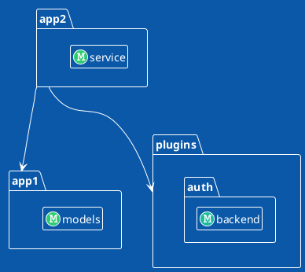

# Description

Generate modules import graph for python project. Using `plantuml` for render.

# Installation

```shell
pip install arch-blueprint
```

# Usage

```shell
arch-blueprint --help
usage: arch-blueprint [-h] --modules [MODULES ...] [--format {puml,d2,json}]
                      [--metric NAME] [--no-cycle-details]
                      project_dir

Generate architecture diagrams for Python applications. Subcommands: 'render'
draws a snapshot, 'diff' compares two.

positional arguments:
  project_dir           Path to root directory of target project

options:
  -h, --help            show this help message and exit
  --modules, -m [MODULES ...]
                        Selected modules for rendering (examples:
                        'myapp.somemodule', 'myapp.somemodule.*',
                        'myapp.*.*.models.*', 'myapp.somemodule.**')
  --format, -f {puml,d2,json}
                        Output format. Possible values: ['puml', 'd2', 'json']
  --metric NAME         Display a metric (repeatable). A node metric renders
                        as a block on each node (e.g. --metric fan_in); a link
                        metric renders as a label on each connection (e.g.
                        --metric edge_weight).
  --no-cycle-details    Hide detailed information for cyclic dependencies
```

A run against the bundled example project:

```shell
arch-blueprint examples/project_root -m 'app1.*' -m 'app2.*' -m 'plugins.**'
```


<details>
<summary>The PlantUML source behind it</summary>



</details>

### How the diagram is built

A **node** is a module. A **link** is aggregated to the namespace where two modules first differ, so
`app2.service` importing `app1.models` is drawn as `app2 ---> app1`. Those endpoints are declared as
`package` blocks with the modules inside, so the emitted source names everything it points at.
(PlantUML would also infer the container from the dotted class names and render the same picture —
declaring it is about the source saying what it means, not about fixing the image.) A namespace that
is itself a module (`writer` importing `storage.backend`) stays a plain class: wrapping a class in a
package of its own name is a syntax error.

`-m` is repeatable, which is how you graph sibling packages under a root that has no `__init__.py`
of its own. A link is drawn when both endpoints belong to the selected set — including a dependency
*on* a package whose children were selected, since `pkg.*` never selects `pkg` itself.

### Errors

Bad input is reported on stderr and exits 2; an analysis that cannot finish exits 1 (`diff` has its
own codes, below). Nothing fails
silently — a mistyped metric name is an error listing the valid ones, and a pattern matching no
modules is an error rather than an empty diagram.

```shell
$ arch-blueprint examples/project_root -m 'app1.*' --metric fanin
arch-blueprint: unknown metric 'fanin'. Available: depth, edge_weight, fan_in, fan_out, instability
```

### Metrics

`--metric NAME` is repeatable and displays a metric. Where it is drawn depends on what it measures:

| Metric | Kind | Drawn as |
| --- | --- | --- |
| `fan_in` | node | a row in the node's block |
| `fan_out` | node | a row in the node's block |
| `instability` | node | a row in the node's block — `fan_out / (fan_in + fan_out)` |
| `edge_weight` | link | a label on the connection: how many imports it stands for |

Blocks appear in the order you asked for them. A cycle is one connection standing for two links, so
a link metric shows both values there as `forward/backward`, matching the order of the cycle's own
detail block.

```shell
arch-blueprint tests/fixtures/cyclic -m 'pkg_a.*' -m 'pkg_b.*' \
  --metric fan_in --metric fan_out --metric instability --metric edge_weight
```


`pkg_b.util` is depended on twice and depends on one module, so `instability: 0.33`. The connection
is a cycle, so `edge_weight` reads `2/1`: two imports one way, one the other — the same two
directions the note spells out.

New metrics are self-contained plugins under `src/arch_blueprint/metrics/`, registered in
`metrics/__init__.py` — no changes to the extractor or renderers are needed. See `CLAUDE.md` for the
protocols.

### Snapshots, render and diff

`-f json` writes a **snapshot** of the graph instead of a diagram: modules, the imports between them
and every metric. Links, cycles and namespace containers are not stored — they are derived from the
imports again on load, so a snapshot cannot hold a stale copy of them. Every diagram can be drawn
from a snapshot, byte for byte the same as a direct run:

```shell
arch-blueprint src -m 'myapp.*' -f json > graph.json
arch-blueprint render graph.json -f puml --metric fan_in > graph.puml
```

`diff` draws what changed between two snapshots, in `puml` or `d2`:

```shell
arch-blueprint diff old.json new.json -f puml > diff.puml
```

It needs no stored files when the project is in git: `--base REV` builds the graph at that revision
(`git archive` into a temporary directory — no worktree, nothing left in `.git`) and compares it
with the working tree, or with `--head REV`. A package that exists on one side only is shown as
added or removed rather than failing the run.

```shell
arch-blueprint diff --base origin/master src -m 'myapp.*' > diff.puml
```


Only the change is drawn, with the unchanged modules its imports connect in grey for context:

| Marker | Module | Dependency |
| --- | --- | --- |
| added | green spot `+`, `«added»` | green bold arrow, `added` |
| removed | red spot `-`, `«removed»`, dashed frame | red dashed arrow, `removed` |
| context | grey spot `M` | — (unchanged dependencies are hidden) |
| new cycle | — | red bold `<->`, `NEW CYCLE`, plus a note listing the imports that close it |
| cycle resolved | — | grey dashed arrow, `cycle resolved`, in the direction that remains (a bare line if neither does) |

Every marker carries text as well as color, so a grey-scale image stays readable. Nothing changed
still gives a valid diagram ("No architectural changes"), so a CI job always has a picture to post.

`diff` exits like `diff(1)`: **0** when nothing changed, **1** when something did, **2** on any
error. The diagram is written either way; to keep a drawing step green on a diff but red on an
error:

```shell
arch-blueprint diff --base origin/master src -m 'myapp.*' > diff.puml || test $? -eq 1
```

A structural diff ignores metrics and depth colors (depth shifts whenever the graph does), and
treats a change to the imports inside a link present on both sides as no change. Graphing
`arch_blueprint` itself always resolves to the running copy, so `diff --base` cannot compare two
versions of this tool.

## Development

This project uses [`uv`](https://docs.astral.sh/uv/).

```shell
uv sync                       # install deps
uv run pytest                 # run the test suite
uv run pre-commit run -a      # lint, format, type-check, test (what CI runs)
```

# Examples

Generated with the code in this repository against released packages, so they can be reproduced:

```shell
pip install --target /tmp/pkgs wemake-python-styleguide fastapi taskiq
arch-blueprint /tmp/pkgs -m 'wemake_python_styleguide.*'
```

## wemake-python-styleguide

`wemake-python-styleguide 1.8.0` — 14 modules, 29 links, **no cycles**.
Source: [`docs/images/wemake.puml`](docs/images/wemake.puml)

What a layered codebase looks like when nothing points back up: `checker` sits alone at the top,
everything drains toward `types`, `constants` and `compat` at the bottom, and no connection is red.
Compare it with the two below, where the red links are cycles the tool found.


## FastAPI

`fastapi 0.141.1` — 27 modules, 65 links, 4 cycles.
Source: [`docs/images/fastapi.puml`](docs/images/fastapi.puml)


## Taskiq

`taskiq 0.12.5` — 31 modules, 87 links, 6 cycles.
Source: [`docs/images/taskiq.puml`](docs/images/taskiq.puml)


## With metrics

```shell
arch-blueprint /tmp/pkgs -m 'taskiq.*' \
  --metric fan_in --metric fan_out --metric instability
```

Every node carries its own block. `taskiq.abc` reads `fan_out: 13, instability: 1.0` — it depends on
thirteen modules and nothing depends on it, which is what an abstract-base module should look like.
`taskiq.compat` is the opposite at `fan_in: 8, instability: 0.0`. Cycles stay highlighted, with the
imports that cause them listed beside the connection.

Source: [`docs/images/taskiq_metrics.puml`](docs/images/taskiq_metrics.puml)


# License

MIT — see [LICENSE](LICENSE).
